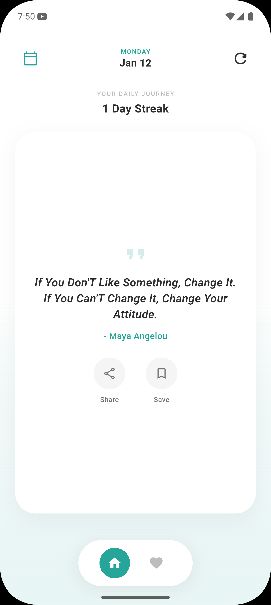
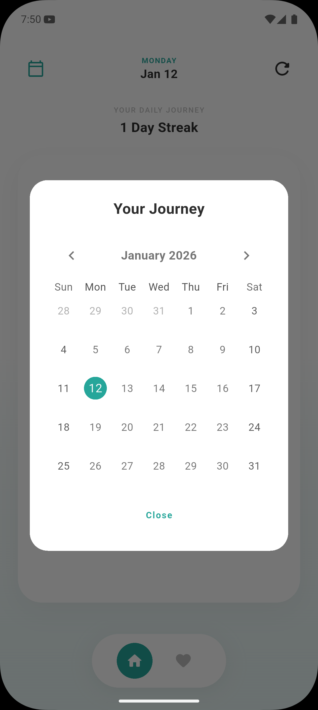

# Daily Quote App 📱✨

A modern, minimal Flutter application that delivers daily inspiration with a beautiful, pixel-perfect UI.

## 🚀 Features

*   **Daily Inspiration**: Fetches a new refreshing quote every 60 seconds (or manually via the refresh button).
*   **Favorites System**: Save your loved quotes. Search through them instantly.
*   **Streak Tracking**: Built-in calendar to track your daily visitation streak.
*   **Share Functionality**: Share quotes via a beautiful, animated bottom sheet.
*   **Premium UI**: Soft teal gradients, glassmorphism, and smooth staggered animations.
*   **Offline Support**: Caches favorites locally.

## 🛠️ Technology Stack

*   **Framework**: Flutter
*   **State Management**: GetX
*   **Networking**: Dio (with DummyJSON API)
*   **Local Storage**: Shared Preferences
*   **UI/UX**: Google Fonts, Shimmer, Lottie-style Animations

## 📖 Documentation

Full documentation regarding the development process, prompt engineering, and design decisions can be found in the `docs` folder.

[**View Full Documentation & Gallery**](https://BuckyBanaz.github.io/Daily-Quote-App/docs/)

---

## 📸 Screenshots

| Home Screen | Favorites | Share Sheet |
|-------------|-----------|-------------|
|  |  |  |

## 🏗️ How to Run

1.  Clone the repository:
    ```bash
    git clone https://github.com/BuckyBanaz/Daily-Quote-App.git
    ```
2.  Navigate to the project:
    ```bash
    cd daily_quotes
    ```
3.  Install dependencies:
    ```bash
    flutter pub get
    ```
4.  Run the app:
    ```bash
    flutter run
    ```

---
*Generated by Google Antigravity Agent*
